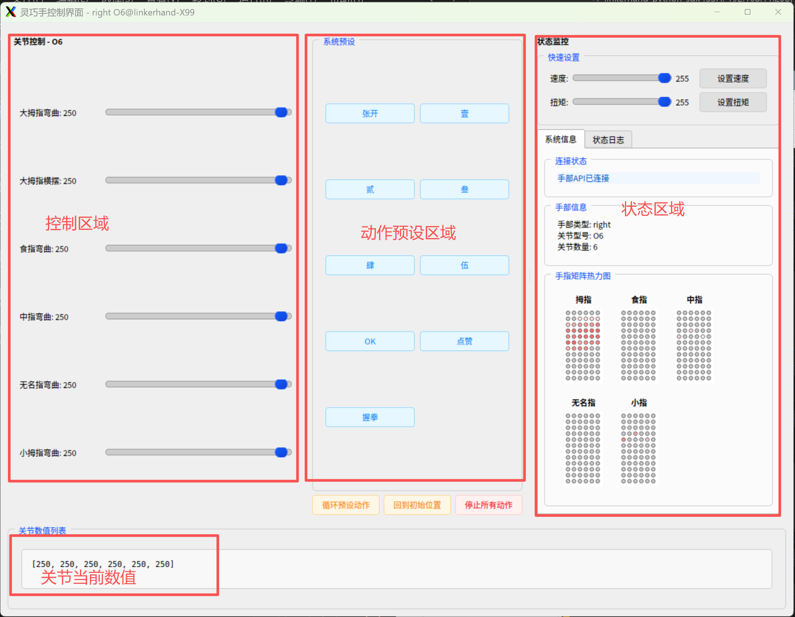

# LinkerHand-Python-SDK

## Overview
LinkerHand Python SDK

[中文](README_CN.md)  |  [English](README.md)

## Caution
- Please ensure that the dexterous hand is not running any other control methods, such as linker_hand_sdk_ros, motion capture glove control, or other topics    controlling the hand, to avoid conflicts.
- Please secure the dexterous hand to prevent it from falling during movement.
- Please ensure the dexterous hand's power and USB-to-CAN connection are correct.

| Name | Version | Link |
| --- | --- | --- |
| Python SDK |     | [](https://github.com/linker-bot/linkerhand-python-sdk) |
| ROS SDK |     | [](https://github.com/linker-bot/linkerhand-ros-sdk) |
| ROS2 SDK |      | [](https://github.com/linker-bot/linkerhand-ros2-sdk) |


## Installation
&ensp;&ensp;You can run the examples after installing the dependencies in requirements.txt. Only Python 3 is supported.
- download

```bash
$ git clone https://github.com/linker-bot/linkerhand-python-sdk.git
```

- install

```bash
$ cd linkerhand-python-sdk/
$ pip3 install -r requirements.txt
```

- 快速使用示例 by CAN
Edit the config/setting.yaml configuration file and modify the parameters according to the comments inside. Set CAN:"can0" and Set MODBUS: "None"
```bash
# Open the CAN port
$ sudo /usr/sbin/ip link set can0 up type can bitrate 1000000 # USB-to-CAN device blue light stays solid. This step can be skipped on Ubuntu systems after modifying setting.ymal as required.
$ cd examples/gui_control
$ sudo chmod a+x gui_control.py
$ python3 gui_control.py
```


## RS485 Protocol Switching (Currently supports O6/L6/L10. For other models, please refer to the MODBUS RS485 protocol document)

Edit the config/setting.yaml configuration file and modify the parameters according to the comments inside. Set MODBUS: "/dev/ttyUSB0", meaning the "modbus" parameter in the configuration file should be "/dev/ttyUSB0". The USB-RS485 converter usually appears as /dev/ttyUSB* or /dev/ttyACM* on Ubuntu. 
modbus: "None" or "/dev/ttyUSB0"
```bash
# Ensure requirements.txt dependencies are installed
# Install system-level related drivers
$ pip install minimalmodbus --break-system-packages
$ pip install pyserial --break-system-packages
$ pip install pymodbus --break-system-packages
# View the USB-RS485 port number
$ ls /dev
# You should see a port similar to ttyUSB0. Grant permissions to the port:
$ sudo chmod 777 /dev/ttyUSB0
# GUI control example
$ python3 example/gui_control/gui_control.py

```


## Related Documentation
[Linker Hand API for Python Document](doc/API-Reference.md)

## Update Log

- > ### release_3.0.1
 - 1、Supports O6/L6/L10 RS485 communication in pymodbus mode.

- > ### release_2.2.4
 - 1、Added support for G20 industrial version dexterous hand.
 - 2、Redrew the GUI.


- > ### release_2.1.9
 - 1、Added support for O6 dexterous hand.

- > ### release_2.1.8
 - 1、Fixed occasional frame collision issue.


  
- Position and Finger Joint Correspondence Table

  O6:  ["Thumb Flexion", "Thumb Adduction/Abduction","Index Finger Flexion", "Middle Finger Flexion", "Ring Finger Flexion","Pinky Finger Flexion"]

  L6:  ["Thumb Flexion", "Thumb Adduction/Abduction","Index Finger Flexion", "Middle Finger Flexion", "Ring Finger Flexion","Pinky Finger Flexion"]

  L7:  ["Thumb Flexion", "Thumb Adduction/Abduction","Index Finger Flexion", "Middle Finger Flexion", "Ring Finger Flexion","Pinky Finger Flexion","Thumb Rotation"]

  L10: ["Thumb CMC Pitch", "Thumb Adduction/Abduction","Index Finger MCP Pitch", "Middle Finger MCP Pitch", "Ring Finger MCP Pitch","Pinky Finger MCP Pitch","Index Finger Adduction/Abduction","Ring Finger Adduction/Abduction","Pinky Finger Adduction/Abduction","Thumb Rotation"]

  L20: ["Thumb CMC Pitch", "Index Finger MCP Pitch", "Middle Finger MCP Pitch", "Ring Finger MCP Pitch","Pinky Finger MCP Pitch","Thumb Adduction/Abduction","Index Finger Adduction/Abduction","Middle Finger Adduction/Abduction","Ring Finger Adduction/Abduction","Pinky Finger Adduction/Abduction","Thumb CMC Yaw","Reserved","Reserved","Reserved","Reserved","Thumb Distal Tip","Index Finger Distal Tip","Middle Finger Distal Tip","Ring Finger Distal Tip","Pinky Finger Distal Tip"]

  G20(工业版): ["Thumb CMC Pitch", "Index Finger MCP Pitch", "Middle Finger MCP Pitch", "Ring Finger MCP Pitch","Pinky Finger MCP Pitch","Thumb Adduction/Abduction","Index Finger Adduction/Abduction","Middle Finger Adduction/Abduction","Ring Finger Adduction/Abduction","Pinky Finger Adduction/Abduction","Thumb CMC Yaw","Reserved","Reserved","Reserved","Reserved","Thumb Distal Tip","Index Finger Distal Tip","Middle Finger Distal Tip","Ring Finger Distal Tip","Pinky Finger Distal Tip"]

  L21: ["Thumb Base Pitch","Index Base Pitch","Middle Base Pitch","Ring Base Pitch","Pinky Base Pitch","Thumb Adduction/Abduction","Index Adduction/Abduction","Middle Adduction/Abduction","Ring Adduction/Abduction","Pinky Adduction/Abduction","Thumb Roll","Reserved","Reserved","Reserved","Reserved","Thumb Middle","Reserved","Reserved","Reserved","Reserved","Thumb Tip","Index Tip","Middle Tip","Ring Tip","Pinky Tip"]

  L25: ["Thumb Base Pitch", "Index Base Pitch", "Middle Base Pitch","Ring Base Pitch","Pinky Base Pitch","Thumb Adduction/Abduction","Index Adduction/Abduction","Middle Adduction/Abduction","Ring Adduction/Abduction","Pinky Adduction/Abduction","Thumb Roll","Reserved","Reserved","Reserved","Reserved","Thumb Middle","Index Middle","Middle Middle","Ring Middle","Pinky Middle","Thumb Tip","Index Tip","Middle Tip","Ring Tip","Pinky Tip"]

## [L10_Example](example/L10)

&ensp;&ensp; __Before running, please modify the configuration information in [setting.yaml](LinkerHand/config/setting.yaml) to match your actual dexterous hand configuration.__

- #### [0000-gui_control](example/gui_control/gui_control.py)
When launched, a UI interface will pop up. You can control the corresponding LinkerHand dexterous hand joint movements using the sliders.

- Adding or modifying action examples. You can add or modify actions in the[constants.py](example/gui_control/config/constants.py)file.
```python
# For example, adding action sequences for L6
"L6": HandConfig(
        joint_names_en=["thumb_cmc_pitch", "thumb_cmc_yaw", "index_mcp_pitch", "middle_mcp_pitch", "pinky_mcp_pitch", "ring_mcp_pitch"],
        joint_names=["大拇指弯曲", "大拇指横摆", "食指弯曲", "中指弯曲", "无名指弯曲", "小拇指弯曲"],
        init_pos=[250] * 6,
        preset_actions={
            "张开": [250, 250, 250, 250, 250, 250],
            "壹": [0, 31, 255, 0, 0, 0],
            "贰": [0, 31, 255, 255, 0, 0],
            "叁": [0, 30, 255, 255, 255, 0], 
            "肆": [0, 30, 255, 255, 255, 255],
            "伍": [250, 250, 250, 250, 250, 250],
            "OK": [54, 41, 164, 250, 250, 250],
            "点赞": [255, 31, 0, 0, 0, 0],
            "握拳": [49, 61, 0, 0, 0, 0],
            # Add custom actions......
        }
    )
```


- #### [0001-linker_hand_fast](example/L10/gesture/linker_hand_fast.py)
- #### [0002-linker_hand_finger_bend](example/L10/gesture/linker_hand_finger_bend.py)
- #### [0003-linker_hand_fist](example/L10/gesture/linker_hand_fist.py)
- #### [0004-linker_hand_open_palm](example/L10/gesture/linker_hand_open_palm.py)
- #### [0005-linker_hand_opposition](example/L10/gesture/linker_hand_opposition.py)
- #### [0006-linker_hand_sway](example/L10/gesture/linker_hand_sway.py)

- #### [0007-linker_hand_get_force](example/L10/get_status/get_force.py) #python3 get_force.py --hand_joint L10 --hand_type right
- #### [0008-linker_hand_get_speed](example/L10/get_status/get_set_speed.py) #python3 get_set_speed.py --hand_joint L10 --hand_type right --speed 100 123 211 121 222   Note: L7 has 7 speed parameters, others have 5.
- #### [0009-linker_hand_get_state](example/L10/get_status/get_set_state.py) # python3 get_set_state.py --hand_joint L10 --hand_type right --position 100 123 211 121 222 255 255 255 255 255  The number of position parameters should refer to the "Position and Finger Joint Correspondence Table".

- #### [0010-linker_hand_dynamic_grasping](example/L10/grab/dynamic_grasping.py)


## API Documentation
[Linker Hand API for Python Document](doc/API-Reference.md)


